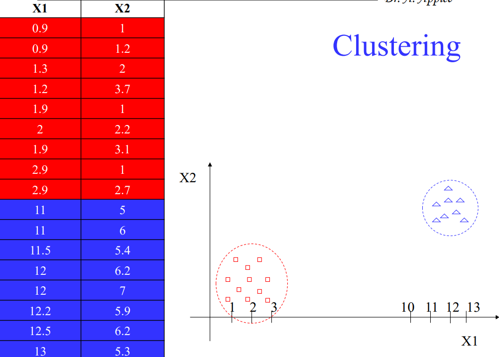

# Quality Treshold clustering Algorithm

Quality Treshold Clustering algorithm in java (University Project). The server fetches data from a database, calculates clusters given a radius and saves them on a file. 

Collaborators: [@CiciStefanoUniba](https://github.com/CiciStefanoUniba) and [@Antob0906](https://github.com/Antob0906)

# 💻 Code


The javadoc are included in the ```code/javadoc``` folder, all the writings, as well as comments, print statements, Uml and the User Manual are written in italian for obvious reasons. Some of the generics (eg. discrete attr) are wrong, also the UML schemas have many errors....

To run the project, simply execute the start.bat file located in the executables folder. This script will:

- Prompt you to enter your MySQL password in order to establish the connection.

- Create a MySQL database and populate it with sample data.

- Generate a dedicated account for the algorithm.

Once the database setup is complete, two terminals will open: Server terminal (running on port 8080), and Client terminal, which is the main interface for user interaction, here you will be prompted with two options:


- Load data from the database (remember to add Mysql library when building the project).

- Load clusters from a file.

### 1) Load Data from Database

This operation will calculate clusters using data from a database. Here is the flow:

- If you provide the table name, the server will attempt to connect to MySQL and retrieve the data;

- After successfully loading the data, the terminal will ask you to enter a radius, which will be used to compute the clusters;

- The calculated clusters (including their centroids) will then be displayed, you will also be asked whether you want to repeat the operation with a new radius;

- If you type n, the program will prompt you to provide a filename under which the clusters will be saved; 

- Afterwards, it will ask whether you want to perform another operation or exit the application.

You can use any extension you want for the filename, although "dmp" is preferred.


### 2) Load Clusters from File

This operation allows you to display pre-calculated clusters from a file:

- Enter the filename (including extension);

- The clusters (with their centroids) will be displayed;

- You will then be asked whether you want to perform another operation or exit.

If you choose to continue, you will be returned to the main menu, otherwise, the client terminal will close, while the server will remain active.  

# 📊 Clustering Algorithm



The algorithm is a Quality Threshold clustering algorithm, here's a brief explanation of how it works:

- For each point in the dataset, form a candidate cluster by including all points within the specified radius;

- Compute the centroid of the candidate cluster and measure its "quality";

- Select the cluster with the best quality and remove its points from the dataset;

- Repeat the process on the remaining points until no further clusters can be formed;

- The result is a set of non-overlapping clusters, each defined by its centroid and the points assigned to it.  


This was a project for the Advanced Programming (Map) Exam, these images are taken from the teacher's slides packet.

